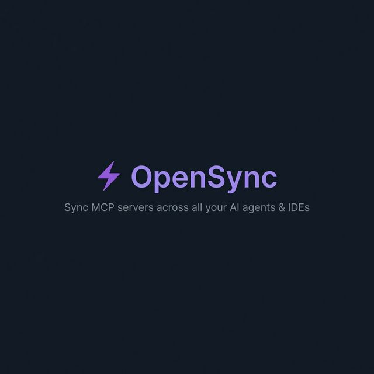

<p align="center">
  
</p>

# OpenSync

**Sync MCP server configurations across AI agents and IDEs — from one place.**

Managing the [Model Context Protocol (MCP)](https://modelcontextprotocol.io/) is painful when you use multiple AI tools. Each editor, CLI, and desktop app keeps its own config file in its own format. Add a server in Cursor, then copy-paste it into Claude Desktop, VS Code, Gemini CLI… and repeat every time something changes.

OpenSync fixes this. Register your MCP servers once, pick the targets you care about, and sync.

---

## ✨ Features

- **Centralized MCP registry** — Add, edit, and remove MCP server definitions in a single local database (SQLite).
- **One-click sync** — Push your servers to any combination of supported targets at once.
- **Auto-discovery** — Detects servers already configured in your installed tools and imports them.
- **Global & project scopes** — Manage a system-wide set of servers *and* per-project overrides.
- **Config backups** — Timestamped backups are created before every write, so nothing is ever lost.
- **Format translation** — Automatically converts between the different JSON schemas each tool expects (standard, VS Code, OpenCode, nested settings, etc.).
- **Project management** — Create named projects, browse directories, and import global servers into any project.
- **Web UI** — A React-based dashboard to manage everything visually.

## 🎯 Supported Targets

| Category | Target | Scope |
|----------|--------|-------|
| **Editors** | Cursor | Global & Project |
| | VS Code | Global & Project |
| | Antigravity | Global & Project |
| | JetBrains (Copilot) | Global |
| **Desktop** | Claude Desktop | Global |
| **CLI** | Claude Code | Global & Project |
| | Gemini CLI | Global & Project |
| | GitHub Copilot CLI | Global & Project |
| | OpenCode | Global & Project |
| **Plugins** | Cline (VS Code) | Global |
| | Roo Code (VS Code) | Global & Project |
| | Roo Code (Antigravity) | Global & Project |
| | Kilo Code (VS Code) | Global & Project |

---

## 📋 Requirements

| Dependency | Version | Purpose |
|------------|---------|---------|
| **Python** | ≥ 3.11 | Backend runtime |
| **[uv](https://docs.astral.sh/uv/)** | latest | Python package & project manager |
| **Node.js** | ≥ 18 | Frontend build tooling |
| **npm** | ≥ 9 | Frontend dependency management |

> [!NOTE]
> OpenSync currently targets **macOS**. Config paths for targets like Claude Desktop and VS Code extensions use macOS-specific locations (`~/Library/Application Support/…`).

---

## 🚀 Getting Started

### 1. Clone the repository

```bash
git clone https://github.com/brandonbraner/open_sync.git
cd open_sync
```

### 2. Install backend dependencies

[uv](https://docs.astral.sh/uv/) handles the virtual environment and dependencies automatically from `pyproject.toml`:

```bash
cd backend
uv sync
cd ..
```

### 3. Install frontend dependencies

```bash
cd frontend
npm install
cd ..
```

### 4. Run the app

The included `run.sh` script starts both servers in parallel:

```bash
./run.sh
```

This will start:

| Service | URL |
|---------|-----|
| Backend (FastAPI) | `http://localhost:8000` |
| Frontend (Vite + React) | `http://localhost:5173` |

Open **<http://localhost:5173>** in your browser.

Press `Ctrl+C` to stop both servers.

#### Running the backend only

If you only need the API (no UI):

```bash
cd backend
uv run main.py
```

The API is available at `http://localhost:8000` with interactive docs at `http://localhost:8000/docs`.

---

## 🏗️ Architecture

```
open_sync/
├── backend/                # FastAPI + SQLite
│   ├── main.py             # Uvicorn entrypoint
│   ├── api.py              # REST API routes
│   ├── models.py           # Pydantic request/response models
│   ├── config_targets.py   # Target definitions (paths, formats, scopes)
│   ├── config_manager.py   # Read / write / sync logic
│   ├── server_registry.py  # CRUD for the MCP server registry
│   ├── project_registry.py # CRUD for named projects
│   ├── database.py         # SQLite schema, migrations, JSON import
│   └── pyproject.toml      # Python dependencies
├── frontend/               # Vite + React 19
│   ├── src/
│   │   ├── App.jsx         # Main application component
│   │   ├── api.js          # API client
│   │   ├── main.jsx        # React entry point
│   │   └── index.css       # Styles
│   └── package.json        # Node dependencies
├── run.sh                  # Dev launcher (backend + frontend)
└── opensync.db             # SQLite database (auto-created on first run)
```

---

## 📡 API Overview

All endpoints are under `/api`. Full interactive documentation is auto-generated at `/docs` when the backend is running.

| Method | Endpoint | Description |
|--------|----------|-------------|
| `GET` | `/api/servers` | List all MCP servers (discovered + registry) |
| `GET` | `/api/registry` | List servers in the OpenSync registry |
| `POST` | `/api/registry` | Add a new server to the registry |
| `PUT` | `/api/registry/{id}` | Update a server by ID |
| `DELETE` | `/api/registry/{id}` | Remove a server by ID |
| `POST` | `/api/registry/import` | Import a global server into a project |
| `GET` | `/api/targets` | List sync targets and their status |
| `POST` | `/api/sync` | Sync servers to selected targets |
| `GET` | `/api/projects` | List all projects |
| `POST` | `/api/projects` | Create a new project |
| `DELETE` | `/api/projects/{name}` | Remove a project |

---

## 🗄️ Data Storage

OpenSync stores all registry data in a local **SQLite** database (`opensync.db`) in the project root. The database is auto-created on first run.

---

## 📄 License

This project is open source. See the repository for license details.
