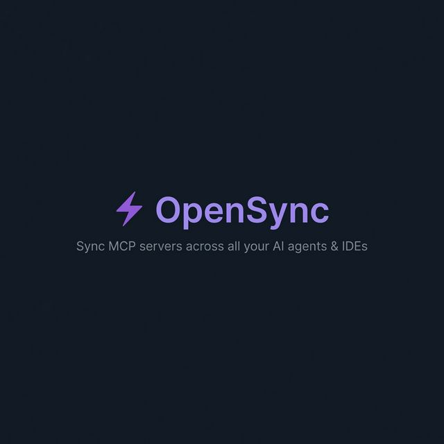

<p align="center">
  
</p>

# OpenSync

**One registry for your MCP servers, skills, slash commands, subagents, and LLM providers — synced to every AI agent you use.**

Every AI tool keeps its own config in its own format: Claude Code wants `.mcp.json` and `SKILL.md` folders, Codex wants TOML, Copilot wants `.vscode/mcp.json` with a different root key, Cursor and Devin want their own dot-directories. Add a server in one tool and you copy-paste it into five others — and again every time it changes.

OpenSync fixes this. Define (or import) everything once in a local registry, pick the tools you care about, preview the exact file diffs, and sync — at the **global** (user) level or per **project**.

---

## ✨ Features

- **Six entity types** — MCP servers, Skills (Agent Skills standard `SKILL.md` folders), Rules/Instructions (synced to CLAUDE.md, AGENTS.md, `.cursor/rules/`, copilot-instructions, …), Commands (slash commands / prompt files / workflows), Subagents, and LLM providers (discovery), each in a central SQLite registry.
- **Create or import** — Add items in the dashboard, pull them in from the configs of tools you already use, or browse the official MCP Registry.
- **Stateful sync, not blind overwrite** — OpenSync remembers what it synced where (per-item hashes). Every item shows its live status per tool:
  `✓ in sync · ↑ outdated (registry changed) · ↓ drifted (changed in the tool) · ⚠ conflict · · not synced · ✕ missing`
- **Diff preview before every write** — Sync is a two-step plan/apply: review unified diffs of every file change, then apply. Drifted items are never silently overwritten — push, pull the tool's version back into the registry, or skip, per item.
- **Global & project scopes** — System-wide configs (`~/...`) and repo-committed configs (`.mcp.json`, `.cursor/`, `.devin/`, `.github/`, …). Registering a project auto-imports everything already configured in it.
- **Format translation** — One canonical model per entity; handlers translate to each tool's format: JSON dialects (standard / VS Code / OpenCode), TOML (Codex — comments and formatting preserved via `tomlkit`), markdown with frontmatter variants, `SKILL.md` folders, Gemini's TOML commands, Warp's YAML workflows.
- **Central, rotated backups** — Every modified file is copied into `~/.opensync/backups/<run>/` before writing; the last 20 runs are kept.
- **Manifest-driven** — Each tool is one declarative manifest in `backend/integrations/`; discovery, sync, status, and the UI all derive from it. Adding a tool is one file.

---

## 🎯 Supported Integrations

| Tool | MCP | Skills | Rules | Commands | Subagents | Notes |
|------|:---:|:------:|:-----:|:--------:|:---------:|-------|
| **Claude Code** | G + P | G + P | G + P | G + P | G + P | `~/.claude.json` / `.mcp.json`; skills in `~/.claude/skills/`; rules as managed blocks in CLAUDE.md |
| **Claude Desktop** | G | — | — | — | — | Skills/connectors are app-UI only |
| **Codex** (CLI + IDE) | G + P | G + P | G + P | G (legacy) | — | `~/.codex/config.toml` (TOML); rules in AGENTS.md; prompts deprecated in favour of skills; cloud Codex reads repo-committed skills/AGENTS.md |
| **GitHub Copilot (VS Code)** | G + P | G + P | P | P | P | `mcp.json` (root key `servers`), `.github/skills`, `.github/instructions`, `.github/prompts`, `.github/agents` |
| **GitHub Copilot CLI** | G + P | G + P | — | — | G + P | Project MCP shared with Claude Code via `.mcp.json` |
| **Cursor** | G + P | G + P | P | G + P | G + P | Rules as `.cursor/rules/*.mdc`; global "User Rules" are settings-UI only |
| **Devin** (Devin Desktop, ex-Windsurf) | G | G + P | G + P | G + P | P | Writes `.devin/`, still reads `.windsurf/`; `~/.codeium/` paths unchanged |
| **Gemini CLI** | G + P | G + P | G + P | G + P | G + P | Rules in GEMINI.md; TOML slash commands |
| **OpenCode** | G + P | G + P | G + P | G + P | G + P | OpenCode-specific MCP entry format; rules in AGENTS.md |
| **Antigravity** | G + P | G + P | — | G + P | — | Uses the shared `.agents/` dirs |
| **Warp** | — | G + P | — | G + P | — | YAML workflows; MCP is app-UI only |

G = global scope, P = project scope. LLM providers are currently **discovery-only** (formats differ too much across tools to write back safely).

Rules synced into shared instruction files (CLAUDE.md, AGENTS.md, GEMINI.md, Devin's global_rules.md) live between `<!-- opensync:rule:… -->` markers — everything you wrote in those files by hand is preserved. Since AGENTS.md is read by Codex, Copilot, Cursor, Devin and others, syncing a rule to Codex at project scope effectively covers every AGENTS.md-aware tool. Cross-tool paths like `.agents/skills/` and `.claude/skills/` are scanned during discovery wherever tools read them.

---

## 🚀 Getting Started

### Run it

Requirements: Python 3.11+ and [uv](https://docs.astral.sh/uv/).

```bash
uvx open-sync
```

That's it — the server starts and the web UI opens in your browser. Until the
package is published to PyPI, run it straight from the repo instead (needs
Node 20+ the first time, to build the UI):

```bash
uvx --from "git+https://github.com/brandon-braner/open_sync#subdirectory=backend" opensync
```

Or install it as a persistent tool: `uv tool install open-sync`, then `opensync`.

Useful flags: `--port`, `--no-browser`, `--db <path>` (registry defaults to
`~/.opensync/opensync.db`).

### Develop

Requirements: Python 3.11+, [uv](https://docs.astral.sh/uv/), Node 20+.

```bash
git clone https://github.com/brandon-braner/open_sync.git
cd open_sync
(cd backend && uv sync)
(cd frontend && npm install)
./run.sh
```

- Backend: http://localhost:8001 (FastAPI; docs at `/docs`)
- Frontend: http://localhost:5173 (Vite dev server with hot reload)

An existing v1 `opensync.db` is migrated automatically on first start (a copy is kept at `opensync.db.pre-v2`).

### Typical flow

1. **Import** — open a section (e.g. MCP Servers) → *Import from tools* tab → everything found in your installed tools is listed with source badges → import.
2. **Edit** — change the item in OpenSync; its status flips to `↑ outdated` for every tool that has the old version.
3. **Sync** — select items + target tools → *Preview sync* → review the diffs → *Apply*.
4. **Reconcile drift** — if you edit a config by hand (or a tool does), the cell shows `↓ drifted`; click it to see the diff and either push the registry version or pull the tool's version back.

### Projects

Register a project directory under **Projects**, and OpenSync manages that repo's committed configs (`.mcp.json`, `.cursor/`, `.claude/`, `.devin/`, `.github/`, …) the same way — anything already configured is imported on registration. Switch between Global and a project with the scope bar at the top.

---

## 🏗 Architecture

```
backend/
├── integrations/        # one declarative manifest per tool (the single source of truth)
│   └── base.py          #   Integration / EntityTarget models
├── engine/
│   ├── engine.py        # discover / import / status / plan / apply / pull
│   ├── handlers/        # format handlers: json_mcp, toml_mcp, markdown_dir,
│   │                    #   skill_dir, toml_command, yaml_workflow, llm_json
│   ├── paths.py         # ~ / project-relative / per-OS path resolution
│   ├── hash.py          # per-item canonical hashing (drift detection)
│   └── backup.py        # central rotated backups
├── db/                  # SQLite schema v2 + v1 migration
├── store.py             # generic CRUD (entities, projects, sync_state)
├── routers/             # /api/integrations, /api/{kind}, /api/sync, ...
└── tests/               # manifest invariants, handler golden tests,
                         #   engine state machine, migration, API flows
frontend/src/
├── entityKinds.js       # per-kind UI config (label, icon, form)
├── pages/EntityPage.jsx # generic list + sync-status matrix + import tab
└── components/          # DiffModal, StatusPill, ScopeBar, Sidebar, forms
```

Key design rules:

- **Manifests drive everything.** No per-tool paths or formats exist outside `backend/integrations/`. The frontend gets all tool metadata from `GET /api/integrations`.
- **Handlers plan, the engine writes.** Handlers return `FileChange(path, before, after)` objects; the engine diffs, backs up, and applies them — that's what makes dry-run previews and backups universal.
- **Per-item hashing.** Drift is detected on the parsed item, not file bytes, so tools that rewrite their config files (Claude Code does constantly) don't cause false drift.

### Adding a new tool

Create one manifest file in `backend/integrations/` and add it to `ALL_INTEGRATIONS` — see [docs/CONTRIBUTING_INTEGRATIONS.md](docs/CONTRIBUTING_INTEGRATIONS.md). The manifest tests (`tests/test_manifests.py`) validate it automatically.

---

## 🧪 Tests

```bash
make test            # backend (pytest)
cd backend && uv run --group dev pytest -v
```

---

## ⚠️ Notes & limitations

- Default paths target **macOS**; Linux/Windows overrides exist per-target via `os_paths` (Claude Desktop and VS Code are filled in, others welcome).
- LLM provider API keys are stored in plain text in the local SQLite db, exactly as they appear in tool configs. Treat `opensync.db` accordingly.
- Avoid syncing to `~/.claude.json` while Claude Code is running — it rewrites that file with session state.
- Codex only honours a project-level `.codex/config.toml` once the project is trusted in Codex.
